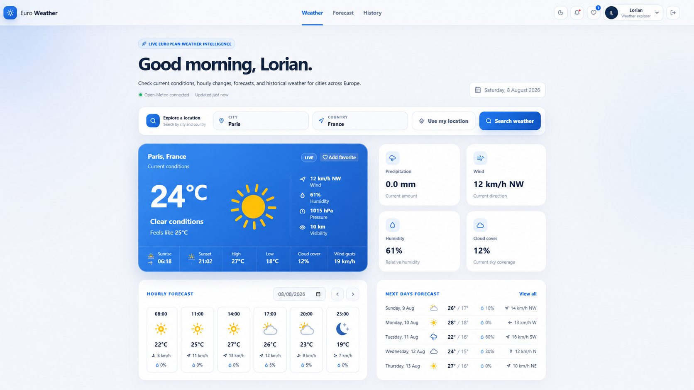
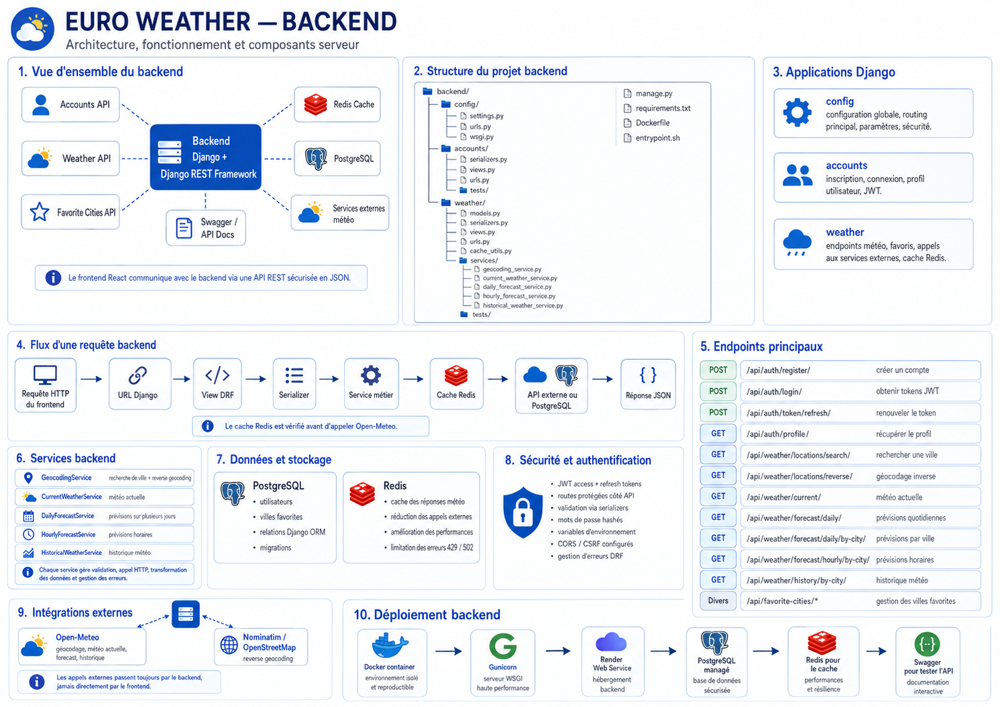

# Euro Weather

Euro Weather is a full-stack weather application that provides current weather conditions, hourly forecasts, daily forecasts, historical weather data, geolocation, favorite cities, and user authentication.

The application is built with a **React frontend**, a **Django REST Framework backend**, **PostgreSQL** for persistent data, and **Redis** for weather and geocoding caching.

---

## Table of Contents

- [Application Preview](#application-preview)
- [Features](#features)
- [Tech Stack](#tech-stack)
- [Global Architecture](#global-architecture)
- [Backend Architecture](#backend-architecture)
- [Frontend Architecture](#frontend-architecture)
- [Database](#database)
- [Redis and Caching](#redis-and-caching)
- [Authentication and JWT](#authentication-and-jwt)
- [External Services](#external-services)
- [Project Structure](#project-structure)
- [API Overview](#api-overview)
- [Local Installation](#local-installation)
- [Environment Variables](#environment-variables)
- [Docker Setup](#docker-setup)
- [Development Commands](#development-commands)
- [Testing](#testing)
- [Production Deployment](#production-deployment)
- [Security](#security)
- [Troubleshooting](#troubleshooting)
- [Future Improvements](#future-improvements)

---

# Application Preview

Euro Weather provides a complete weather dashboard where authenticated users can search for a location, use their current position, view forecasts, consult historical weather data, and manage favorite cities.


## Main Application Pages

The application includes:

- Login page
- Registration page
- Weather dashboard
- Current weather information
- Hourly forecast
- 7-day forecast
- Historical weather
- Favorite cities
- User profile
- Browser geolocation with **Use my location**

Real application screenshots can be stored in:

### Dashboard


```

---

# Features

## Weather Features

Euro Weather provides several weather-related features.

### Current Weather

Users can retrieve the current weather using:

- city and country;
- latitude and longitude;
- browser geolocation.

Weather information includes values such as:

- temperature;
- apparent temperature;
- humidity;
- precipitation;
- wind speed;
- cloud cover;
- sunrise;
- sunset;
- weather conditions.

### Hourly Forecast

Users can view detailed hourly forecasts for a selected day.

The hourly forecast can include:

- temperature;
- precipitation;
- wind speed;
- weather conditions;
- other hourly weather indicators.

### Daily Forecast

The application provides multi-day weather forecasts.

For example:

```text
Today
Tomorrow
Day 3
Day 4
Day 5
Day 6
Day 7
```

Users can select a day to display its detailed hourly forecast.

### Historical Weather

Users can retrieve weather information from previous dates.

### Location Search

Users can search for cities by name and country.

### Reverse Geocoding

Coordinates obtained from the browser can be converted into a readable city and country.

Example:

```text
48.8566, 2.3522
        ↓
Paris, France
```

### Use My Location

The browser Geolocation API can retrieve the user's current coordinates.

The frontend sends these coordinates to the backend, which retrieves the corresponding weather information.

---

# User Features

Euro Weather also provides authenticated user features.

Users can:

- create an account;
- log in;
- log out;
- access protected pages;
- view their profile;
- save favorite cities;
- remove favorite cities;
- quickly reload weather for a favorite location.

---

# Tech Stack

## Frontend

- React
- Vite
- React Router
- JavaScript
- CSS
- Lucide React
- Vitest
- React Testing Library

## Backend

- Python
- Django
- Django REST Framework
- JWT Authentication
- Django Simple JWT
- drf-spectacular
- Gunicorn

## Database

- PostgreSQL 17

## Cache

- Redis

## External Services

- Open-Meteo
- Nominatim / OpenStreetMap

## Infrastructure

- Docker
- Docker Compose
- Nginx
- Render

---

# Global Architecture


The application follows a client-server architecture.

```text
                        ┌──────────────────────┐
                        │        USER          │
                        │    Web Browser       │
                        └──────────┬───────────┘
                                   │
                                   │ HTTPS
                                   ▼
                        ┌──────────────────────┐
                        │      FRONTEND        │
                        │   React + Vite       │
                        └──────────┬───────────┘
                                   │
                                   │ REST API / JSON
                                   ▼
                        ┌──────────────────────┐
                        │       BACKEND        │
                        │ Django REST Framework│
                        └───────┬─────┬────────┘
                                │     │
                ┌───────────────┘     └────────────────┐
                │                                      │
                ▼                                      ▼
      ┌──────────────────────┐              ┌──────────────────────┐
      │      PostgreSQL      │              │        Redis         │
      │ Users / Favorites    │              │    Shared Cache      │
      └──────────────────────┘              └──────────────────────┘
                                                       │
                                                       │
                                                       ▼
                                            ┌──────────────────────┐
                                            │   External Services  │
                                            │                      │
                                            │ Open-Meteo           │
                                            │ Nominatim            │
                                            └──────────────────────┘
```

The frontend does not communicate directly with weather providers.

All weather requests go through the Django API.

This gives the backend control over:

- validation;
- caching;
- error handling;
- provider communication;
- authentication;
- response formatting.

---

# Backend Architecture



The backend is built using Django and Django REST Framework.

A typical request follows this flow:

```text
HTTP Request
     ↓
Django URL
     ↓
API View
     ↓
Serializer Validation
     ↓
Service
     ↓
Redis Cache
     ↓
External Weather Provider
     ↓
Normalized Response
     ↓
Frontend
```

---

## Backend Responsibilities

The backend is responsible for:

- authentication;
- authorization;
- user management;
- favorite city management;
- weather requests;
- geocoding;
- reverse geocoding;
- Redis caching;
- external API communication;
- input validation;
- error handling.

---

## Views

Django REST Framework views receive HTTP requests.

Their responsibilities include:

- validating the request;
- calling services;
- handling exceptions;
- returning HTTP responses.

Typical responses include:

```text
200 OK
201 Created
400 Bad Request
401 Unauthorized
404 Not Found
502 Bad Gateway
503 Service Unavailable
```

---

## Serializers

Serializers validate incoming data.

Examples include:

- latitude;
- longitude;
- city;
- country;
- forecast days;
- dates;
- registration information;
- favorite city information.

Example:

```text
latitude = 48.8566
longitude = 2.3522
forecast_date = 2026-08-07
```

---

## Weather Services

External API communication is separated from views using service classes.

The weather service layer can contain services such as:

```text
backend/weather/services/
├── current_weather_service.py
├── daily_forecast_service.py
├── hourly_forecast_service.py
├── historical_weather_service.py
└── geocoding_service.py
```

The purpose of the service layer is to keep API views simple.

Views manage HTTP requests.

Services manage business logic and communication with external providers.

---

# Frontend Architecture


The frontend is built with React and Vite.
---

# Database


Euro Weather uses PostgreSQL for persistent application data.

Weather forecasts themselves are not permanently stored in PostgreSQL.

They are retrieved from external providers and temporarily cached in Redis.

---

# Authentication and JWT


Euro Weather uses JSON Web Tokens for authentication.

---

## Protected Routes

Pages requiring authentication use a protected-route mechanism.

Example:

```text
ProtectedRoute.jsx
```

If the user is authenticated:

```text
Protected Route
      ↓
Display Page
```

Otherwise:

```text
Protected Route
      ↓
Redirect to Login
```

---

# External Services

Euro Weather depends on external services for weather and geographic information.

---

## Open-Meteo

Open-Meteo provides weather information.

It can be used for:

- current weather;
- hourly forecast;
- daily forecast;
- historical weather;
- location search.

The Django backend communicates with Open-Meteo.

The frontend does not communicate directly with Open-Meteo.

```

The backend sends an appropriate User-Agent header when communicating with Nominatim.

---

# Project Structure

The repository is organized into backend and frontend applications.

---

# API Overview

Euro Weather exposes REST endpoints through Django REST Framework.

The exact endpoint list can be checked in the project's Django URL configuration and API documentation.

---

## Authentication API

The authentication API provides operations such as:

```text
Register
Login
Refresh token
User profile
```

Typical operations:

| Operation | Method |
|---|---|
| Register | POST |
| Login | POST |
| Refresh JWT | POST |
| Get profile | GET |
| Update profile | PATCH |

---

# Weather API

Weather endpoints support both coordinates and city-based requests.

---

# Local Installation

## Requirements

Install:

- Git
- Docker Desktop
- Docker Compose

Node.js and Python are only required when running the frontend or backend outside Docker.

---

## Clone the Project

```bash
git clone <repository-url>
cd euro-weather
```

---

## Create Environment File

Copy the example environment file.

### Linux / macOS

```bash
cp .env.example .env
```

### Windows PowerShell

```powershell
Copy-Item .env.example .env
```

Then configure the values inside `.env`.

---

# Environment Variables

Sensitive values must never be committed to Git.

Use:

```text
.env.example
.env.prod.example
```

to document required environment variables without exposing real credentials.

---

## Backend Example

```env
DEBUG=True

SECRET_KEY=change-me

ALLOWED_HOSTS=localhost,127.0.0.1

DATABASE_URL=postgresql://user:password@db:5432/euro_weather

REDIS_URL=redis://redis:6379/1

CORS_ALLOWED_ORIGINS=http://localhost:5173

CSRF_TRUSTED_ORIGINS=http://localhost:5173
```

Depending on the Docker configuration, PostgreSQL may also use:

```env
POSTGRES_DB=euro_weather
POSTGRES_USER=postgres
POSTGRES_PASSWORD=change-me
```

---

## Frontend Example

```env
VITE_API_BASE_URL=http://localhost:8000
```

Production:

```env
VITE_API_BASE_URL=https://euro-weather-api.onrender.com
```

---

# Docker Setup

Docker Compose is used to run the application locally.

---

## Start the Application

From the project root:

```powershell
docker compose up -d --build
```

---

## Check Running Services

```powershell
docker compose ps
```

---

## Check Docker Containers

```powershell
docker ps
```

---

## Stop the Application

```powershell
docker compose down
```

---

## Restart Backend

```powershell
docker compose restart backend
```

---

## Rebuild Backend

```powershell
docker compose up -d --build backend
```

---

## Rebuild Frontend

```powershell
docker compose up -d --build --force-recreate frontend
```

---

# Production Deployment


Euro Weather can be deployed using Render.

A typical production architecture is:

```text
                    Internet
                       │
                       ▼
              ┌──────────────────┐
              │ Frontend Service │
              │ React + Nginx    │
              └────────┬─────────┘
                       │
                       │ HTTPS
                       ▼
              ┌──────────────────┐
              │ Backend Service  │
              │ Django + Gunicorn│
              └───────┬──────────┘
                      │
          ┌───────────┼─────────────┐
          │           │             │
          ▼           ▼             ▼
     PostgreSQL     Redis       Open-Meteo
                                  │
                                  ▼
                              Nominatim
```

---

# Backend Production

The backend runs Django using Gunicorn.

Example:

```bash
gunicorn config.wsgi:application --bind 0.0.0.0:$PORT
```

The backend connects to:

- PostgreSQL;
- Redis;
- Open-Meteo;
- Nominatim.

---

# Frontend Production

The frontend is built using Vite.

Example build:

```bash
npm run build
```

The generated files are located in:

```text
dist/
```

They can then be served using Nginx.

---

# Production API URL

The project has used:

```text
https://euro-weather-api.onrender.com
```

The frontend receives the backend URL through:

```env
VITE_API_BASE_URL=https://euro-weather-api.onrender.com
```

The backend URL should not be duplicated directly inside React components.

---

# Security

## Environment Variables

Never commit:

```text
SECRET_KEY
POSTGRES_PASSWORD
DATABASE_URL with real credentials
Redis credentials
Access tokens
Refresh tokens
```

---

## `.gitignore`

Sensitive environment files should be ignored.

Example:

```gitignore
.env
.env.prod
```

Files containing placeholders can remain versioned:

```text
.env.example
.env.prod.example
```

---

## Password Security

Django handles password hashing.

Passwords should never be stored directly in PostgreSQL as plaintext.

---

## JWT Security

JWT access tokens should have a limited lifetime.

Refresh tokens are used to obtain new access tokens.

---

## CORS

Only trusted frontend origins should be allowed in production.

Example:

```env
CORS_ALLOWED_ORIGINS=https://your-frontend-domain.com
```

Avoid using unrestricted production origins unless intentionally required.

---

## External API Requests

Requests to external providers should always use a timeout.

Example:

```python
requests.get(
    url,
    params=params,
    timeout=10,
)
```

This prevents the Django request from waiting indefinitely when an external provider is unavailable.

---

# Troubleshooting

## `npm` Cannot Find `package.json`

If you execute:

```powershell
npm run build
```

from:

```text
D:\myprojects\euro-weather
```

you may receive:

```text
ENOENT
Could not read package.json
```

The frontend `package.json` is inside:

```text
frontend/
```

Run:

```powershell
cd frontend
npm run build
```

---

## Docker Logs

Correct syntax:

```powershell
docker compose logs backend
```

Incorrect:

```powershell
docker compose exec logs backend
```

`logs` is a Docker Compose command, not a service.

---

## Weather API Returns 502

Example:

```text
502 Bad Gateway
```

This usually means:

```text
Frontend
   ↓
Backend reachable
   ↓
External weather provider failed
```

Check backend logs:

```powershell
docker compose logs backend
```

For production, check Render logs.

---

## Redis Cache Appears Empty

Make sure you are inspecting the correct Redis database.

Example:

```powershell
docker compose exec redis redis-cli -n 1 --scan
```

Redis database `0` and Redis database `1` are different.

---

## Redis Cache Survives Backend Restart

This is expected.

Example:

```powershell
docker compose restart backend
```

Redis is a separate service.

Restarting Django does not remove Redis keys.

---

## Geolocation Does Not Work

Check:

1. Browser permission for location.
2. HTTPS in production.
3. Browser developer console.
4. Django backend logs.
5. Reverse geocoding endpoint.
6. Nominatim response.

The browser must allow location access.

---

# Future Improvements

Possible improvements for Euro Weather include:

- dark mode;
- multilingual support;
- selectable temperature units;
- advanced weather charts;
- precipitation graphs;
- weather maps;
- severe weather alerts;
- user notification preferences;
- improved historical analytics;
- additional favorite-city filtering;
- improved mobile UI;
- Progressive Web App support;
- automated CI/CD;
- end-to-end testing;
- code coverage reporting;
- rate limiting;
- structured logging;
- monitoring and observability;
- Redis cache metrics;
- improved accessibility.

---

# Documentation Images

Architecture diagrams can be stored inside:

```text
docs/images/
```

Recommended files:

```text
docs/images/
├── application-overview.png
├── architecture-overview.png
├── backend-architecture.png
├── frontend-architecture.png
├── database-schema.png
├── caching-flow.png
├── authentication-flow.png
└── deployment-architecture.png
```

Application screenshots can be stored separately:

```text
docs/images/screenshots/
├── login.png
├── register.png
├── dashboard.png
├── current-weather.png
├── hourly-forecast.png
├── daily-forecast.png
├── historical-weather.png
├── favorites.png
├── use-my-location.png
└── profile.png
```

---

# Author

**Euro Weather** by **Lorian Elvis**

Full-stack weather application built with React, Django REST Framework, PostgreSQL, Redis, Docker, and external weather services.
